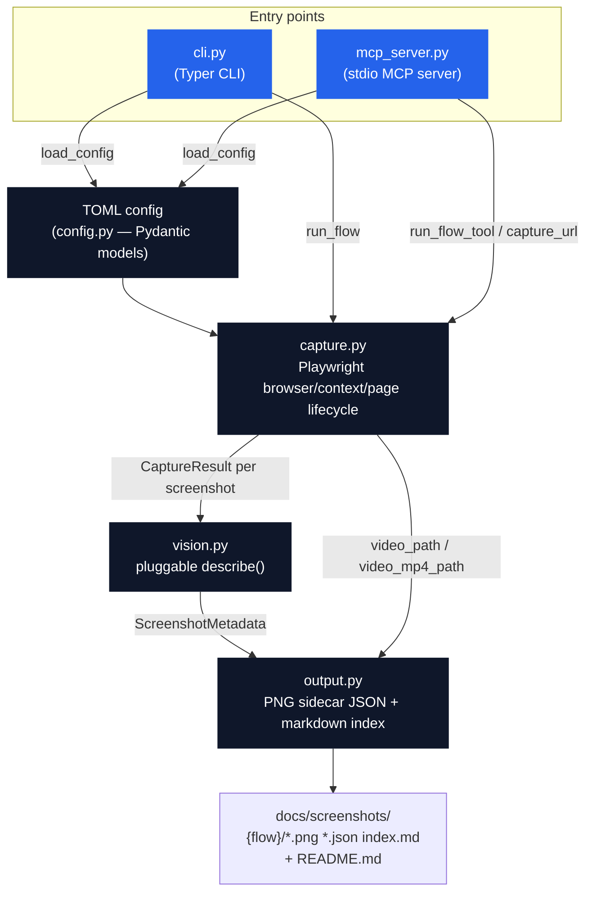
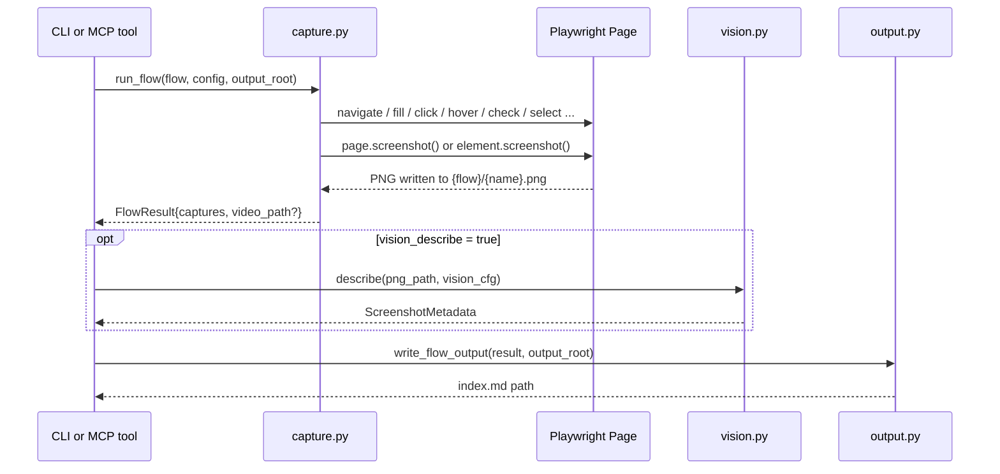

# Architecture

Screenwright has two entry points (CLI, MCP server) that both call into the same
capture/vision/output core. Neither entry point talks to Playwright directly —
`capture.py` owns the browser lifecycle.

## Module responsibilities

| Module | Owns |
|---|---|
| `config.py` | TOML → Pydantic models (`ScreenwrightConfig`, `Flow`, `Step` discriminated union, `VisionConfig`). No I/O beyond reading the TOML file. |
| `capture.py` | The only module that touches Playwright. `run_flow` drives one `Browser` + (optionally) one recording `BrowserContext` through a flow's steps, closes them, and finalizes video. `capture_single_url` is the one-shot path used by the MCP `capture_url`/`capture_element` tools. |
| `vision.py` | `describe(image_path, cfg) -> ScreenshotMetadata`. Three private per-provider implementations (`_describe_anthropic`, `_describe_openai`, `_describe_ollama`) share prompt-building (`_build_prompt`) and response-parsing (`_parse_response`, which degrades gracefully to a raw-text description if the model doesn't return valid JSON). |
| `output.py` | Turns `FlowResult`/`CaptureResult` objects into the on-disk docs structure: `{name}.json` sidecars, `{flow}/index.md`, root `README.md`. |
| `cli.py` | Typer commands (`run`, `flows`) — orchestrates `load_config → run_flow → describe (if enabled) → write_flow_output`, one flow at a time, with a Rich progress display. |
| `mcp_server.py` | FastMCP server exposing `capture_url`, `capture_element`, `run_flow_tool`, `list_flows`, `describe_screenshot` as MCP tools over stdio. Config resolution falls back to `SCREENWRIGHT_CONFIG` env var when a tool call doesn't pass `config_path`. |
| `discovery.py` | Scaffolded, not wired into either entry point yet (see roadmap item **c** in the README — FastAPI `/openapi.json` route discovery). |

## Data flow for one `capture` step

## Why this shape

- **One capture core, two entry points.** The CLI and the MCP server are both thin — all the
  actual Playwright/vision/output logic lives in `capture.py`/`vision.py`/`output.py` so the two
  entry points can't drift out of sync.
- **Video recording is flow-scoped, not step-scoped**, because Playwright ties video capture to
  a `BrowserContext`, which can't be paused/resumed mid-flow. See `Flow.record` in `config.py`
  and the context-vs-page branch in `capture.py::run_flow`.
- **Vision is fully optional and provider-swappable** so a private/air-gapped flow (Moondream2
  via Ollama) and a cloud flow (Claude Haiku / GPT-4o-mini) use the exact same `describe()`
  interface and the exact same `ScreenshotMetadata` shape downstream.
