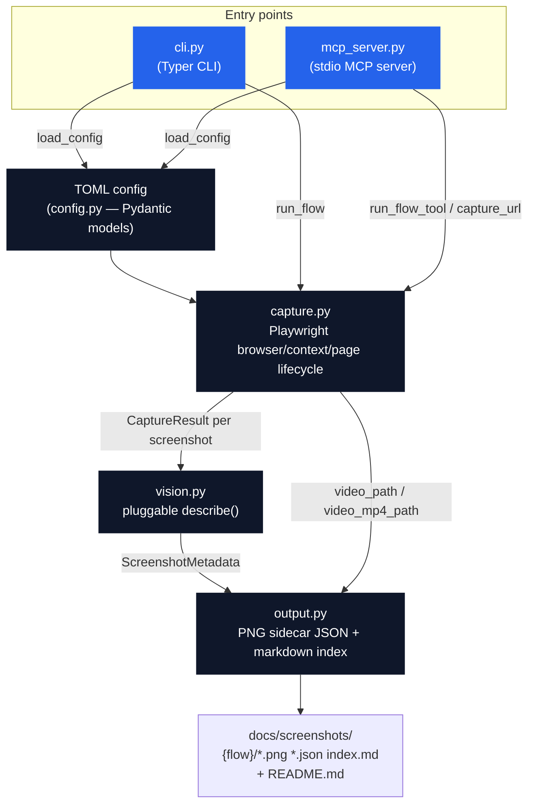
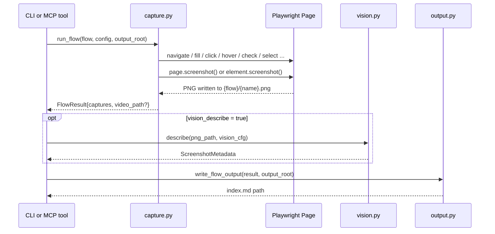

# Architecture

Screenwright has two entry points (CLI, MCP server) that both call into the same
capture/vision/output core. Neither entry point talks to Playwright directly —
`capture.py` owns the browser lifecycle.

## Module responsibilities

| Module | Owns |
|---|---|
| `config.py` | TOML → Pydantic models (`ScreenwrightConfig`, `Flow`, `Step` discriminated union, `VisionConfig`). No I/O beyond reading the TOML file. |
| `capture.py` | The only module that touches Playwright. `run_flow` drives one `Browser` + (optionally) one recording `BrowserContext` through a flow's steps, closes them, and finalizes video. `capture_single_url` is the one-shot path used by the MCP `capture_url`/`capture_element` tools. |
| `vision.py` | `describe(image_path, cfg) -> ScreenshotMetadata`. Three private per-provider implementations (`_describe_anthropic`, `_describe_openai`, `_describe_ollama`) share prompt-building (`_build_prompt`) and response-parsing (`_parse_response`, which degrades gracefully to a raw-text description if the model doesn't return valid JSON). |
| `output.py` | Turns `FlowResult`/`CaptureResult` objects into the on-disk docs structure: `{name}.json` sidecars, `{flow}/index.md`, root `README.md`. |
| `cli.py` | Typer commands (`run`, `flows`) — orchestrates `load_config → run_flow → describe (if enabled) → write_flow_output`, one flow at a time, with a Rich progress display. |
| `mcp_server.py` | FastMCP server exposing `capture_url`, `capture_element`, `run_flow_tool`, `list_flows`, `describe_flow`, `describe_screenshot` as MCP tools over stdio. Config resolution falls back to `SCREENWRIGHT_CONFIG` env var when a tool call doesn't pass `config_path`. |

## Data flow for one `capture` step

## Why this shape

- **One capture core, two entry points.** The CLI and the MCP server are both thin — all the
  actual Playwright/vision/output logic lives in `capture.py`/`vision.py`/`output.py` so the two
  entry points can't drift out of sync.
- **Video recording is flow-scoped, not step-scoped**, because Playwright ties video capture to
  a `BrowserContext`, which can't be paused/resumed mid-flow. See `Flow.record` in `config.py`
  and the context-vs-page branch in `capture.py::run_flow`.
- **Vision is fully optional and provider-swappable** so a private/air-gapped flow (Moondream2
  via Ollama) and a cloud flow (Claude Haiku / GPT-4o-mini) use the exact same `describe()`
  interface and the exact same `ScreenshotMetadata` shape downstream.
- **Neither browser/context/page setup nor a step failure ever raises out of `run_flow`.** Setup
  (including loading `Flow.storage_state`) and the step loop are both wrapped — a bad
  `storage_state` path, a missing/expired session, or a bad selector on step 4 of 5 all land on
  `FlowResult.error`/`failed_step_index`, and video is always finalized + the browser always
  closed in a `finally` block regardless of where things stopped. `run_flow_tool` surfaces this
  as a `{captures, error, failed_step_index, ...}` dict so an agent driving Screenwright sees a
  partial result it can act on, not a failed tool call or an unhandled exception.
- **Browser launch itself is now inside that same contract, too.** `p.chromium.launch()` used
  to sit outside every setup/step/finalize try block in `run_flow` — the one remaining gap in
  the "never raise" guarantee described above. A missing/corrupted Chromium install or a
  resource-exhausted host would crash `run_flow_tool` with an unhandled exception instead of the
  clean partial `FlowResult` every other failure path already returns. Fixed by wrapping the
  launch call itself and returning early with `result.error` set on failure — there's nothing to
  close in that case, since Playwright's `launch()` never leaves an orphaned process behind on
  its own failure.
- **Auth is session injection, not scripted login.** `Flow.storage_state` loads Playwright's own
  cookie/localStorage export before any step runs — the standard, robust way to capture an
  already-authenticated session for an internal app, instead of re-running a fragile
  fill/click login sequence (2FA, CAPTCHAs, rate limits) on every capture.
- **Accessibility snapshots are a first-class capture output, not a vision-model afterthought.**
  `CaptureStep.accessibility_snapshot` writes Playwright's `aria_snapshot()` — the exact
  semantic tree assistive technology sees — to `{name}.aria.yaml`, free and deterministic,
  versus a vision model's paid, approximate guess at the same PNG. Always whole-page: Playwright
  exposes `aria_snapshot()` on `Page`/`Locator`, not on the `ElementHandle` this step's
  selector-scoped screenshot path uses.
- **PDF export follows the same shape, for the same reason.** `CaptureStep.pdf` calls
  `page.pdf()` — also whole-page-only, also Chromium-only — so it's not scoped to `selector`
  either, matching `accessibility_snapshot`'s constraint rather than pretending otherwise.
- **Capture variants change the existing page in place, not the browser/context lifecycle.**
  `CaptureStep.variants` loops within the existing `CaptureStep` branch and calls
  `page.set_viewport_size()`/`page.emulate_media()` on the already-open page before each
  variant's capture — no new context or page is created. This was a deliberate choice over the
  alternative (spin up a fresh context per variant) specifically to avoid touching the
  browser/context setup path at all, keeping this feature low-risk against the well-tested
  video-recording and error-handling code that setup path shares. One real gotcha this
  uncovered: `page.emulate_media(color_scheme=None)` is a no-op, not a reset — restoring the
  flow's default after a `color_scheme` variant requires an explicit `"light"`, not `None`.
- **Determinism is the default, not opt-in.** `CaptureStep.animations` defaults to `"disabled"`
  (Playwright's own screenshot default is `"allow"`) — a deliberate departure, since a
  documentation tool capturing a random mid-animation frame is rarely intended and is the
  single biggest source of unnecessary pixel diffs between otherwise-identical runs.
  `CaptureStep.mask` fills selected elements with a solid color before capturing (live clocks,
  avatars, etc.); unlike `selector`, a `mask` entry matching nothing is a silent no-op, verified
  directly against the installed Playwright before relying on it — an optional masking target
  not being present everywhere a flow runs isn't a flow failure.
- **Concurrency is opt-in, not the default, in the CLI.** `cli.py run --concurrency N` bounds
  concurrent flows with an `asyncio.Semaphore`, defaulting to 1 — identical sequential behavior
  to before this option existed. This meant restructuring `run` from "call `asyncio.run()` once
  per flow in a sync loop" to one `asyncio.run()` wrapping the whole command, and wrapping the
  synchronous `describe()` call in `asyncio.to_thread()` so it doesn't block other flows'
  progress under `--concurrency > 1`. The per-flow progress task is created only after the
  semaphore is acquired (not upfront for every flow), so the default case's progress display is
  pixel-for-pixel the same as before — tasks appear one at a time, in order.
- **HAR capture required broadening the page-close logic, not just adding a Playwright kwarg.**
  `Flow.har` passes `record_har_path` to `browser.new_page()`/`new_context()` the same way
  `storage_state` does, but the `.har` file — like `.webm` — only flushes when the page (and
  context, if any) is explicitly closed, not on `browser.close()` alone. Before this, the
  non-`record` path never closed `page` explicitly (relying on `browser.close()` to sweep it
  up), which is exactly the case where HAR would have silently produced an empty/missing file.
  Verified directly against the installed Playwright before writing any code, and the finalize
  block's guard broadened from `context is not None and page is not None` to just
  `page is not None` so `page.close()` always runs — harmless when neither video nor HAR is
  active, required when either is.
- **`--check` is an exact-byte diff living entirely in `cli.py`, not a perceptual-diff feature
  in the capture engine.** `run_flow`/`capture.py` are unchanged; `_process_flow` hashes a flow's
  output directory's PNGs (SHA256) before running it, then again after, and reports any filename
  whose hash changed or is new. Hashing is skipped entirely when `--check` isn't passed (`before`
  is `{}`, `changed` is always `[]`), so the common case pays no cost for a feature it doesn't
  use. This intentionally pairs with (and depends on) the determinism work above — a page with
  residual non-determinism will report false positives under `--check`; the fix is tightening
  `animations`/`mask`, not adding pixel tolerance here. A perceptual/pixel-diff mode with a
  persisted baseline store was considered and deferred as materially larger scope for the same
  Opus-review-backlog item; this exact-byte MVP covers the CI-gate use case (did anything change
  at all) without it.
- **Navigation retries with backoff, mirroring `vision.py`'s existing retry pattern but async.**
  `vision.py`'s `_with_retry` is synchronous (the vendor SDK clients it wraps are synchronous);
  `page.goto()` is async, so `capture.py` gained its own `_goto_with_retry`/
  `_is_transient_navigation_error` pair rather than sharing code across the sync/async divide.
  Retries up to 2x with the same 1s/2s exponential backoff as vision, only on
  `playwright.async_api.TimeoutError` or an `Error` whose message contains `net::ERR_` (DNS
  hiccup, connection reset) — anything else (a 404, a malformed selector-bearing URL) is a real
  error that retrying would just delay reporting. Applied to both `run_flow`'s per-step
  `NavigateStep` handling and `capture_single_url`'s initial navigation; the existing per-step
  try/except in `run_flow` already turns an exhausted-retries raise into `FlowResult.error`, so
  no additional error-handling changes were needed there.
- **The mp4-conversion call was the one finalize-block step never brought under the
  "never raise" contract.** `run_flow`'s browser/context setup and its per-step loop both catch
  exceptions and report them via `FlowResult.error`, but `_convert_to_mp4(final_path)` (called
  when `record_mp4 = true`) was still unguarded — a missing `ffmpeg` or a failed conversion
  propagated straight out of `run_flow`, and neither `cli.py` nor `mcp_server.py` wraps that
  call, so it crashed the whole CLI run or MCP tool call rather than reporting a partial result.
  Fixed by wrapping just that call in try/except and appending to `result.error` (chained with a
  step failure's error if one already occurred) — `result.video_path` and every capture already
  written stay intact.
- **`capture_single_url` never had `run_flow`'s browser-close guarantee.** `run_flow` wraps its
  whole body in try/finally so `browser.close()` always runs; `capture_single_url` — the function
  behind the MCP `capture_url`/`capture_element` tools — called `await browser.close()` as its
  literal last line instead, so any exception from `new_page`, navigation, or the capture itself
  (a bad `selector` is the common case) skipped it and leaked the Chromium process. Real risk on
  the MCP surface specifically: an agent plausibly retries `capture_url`/`capture_element` with a
  different selector after a "Selector not found" error, leaking one more browser per failed
  attempt. Fixed by wrapping the body in try/finally, matching `run_flow`'s existing pattern
  exactly — no behavior change to what gets raised or returned on success, only a guarantee that
  cleanup always runs.
- **The video/HAR finalize block's `page.close()`/`context.close()`/`.webm` rename could still
  raise past the mp4-conversion fix.** That fix wrapped only `_convert_to_mp4`; the surrounding
  `page.close()`, `context.close()`, `video.path()`, and `raw_path.replace(final_path)` calls
  were still unguarded — a full disk, a page that crashed mid-flow, or a Playwright internal
  error on close would still propagate out of `run_flow` unhandled. Wrapped the whole block in
  an outer try/except that appends `Failed to finalize video/HAR: ...` to `result.error`
  (chained with any earlier step/mp4 error), finally completing the "always return a
  `FlowResult`, never raise" contract for every path through `run_flow`'s finalize logic, not
  just the mp4-specific one.
- **A partial flow's failure was invisible in the generated docs themselves.** Every fix above
  ensures a mid-flow failure returns a `FlowResult` with `.error` set instead of raising, but
  `output.py`'s `_flow_index_md`/`_root_readme_md` never rendered that field — a partial run's
  `index.md` and root `README.md` looked identical to a fully successful one; the failure was
  only visible in ephemeral CLI console output. Fixed by adding a `⚠️ Flow stopped early: ...`
  banner (escaped through the existing `_escape_markdown_cell`, since `.error` can embed a
  selector string or other config-derived text) above a flow's capture table when `.error` is
  set, and a `✅`/`⚠️ Partial` Status column to the root README's flow table.
- **`ScreenwrightConfig` never rejected duplicate flow names.** Every flow's output path is
  derived from its name (`output_dir / flow.name`), so two flows sharing a name silently wrote
  to the same directory — one overwriting the other's captures/index.md, `get_flow()` only ever
  returning the first match, and (under `--concurrency > 1`) both flows recording video/HAR to
  the same directory concurrently, which can corrupt either file. A copy-paste typo in TOML is
  the realistic trigger. Fixed with a `model_validator(mode="after")` on `ScreenwrightConfig`
  that rejects (doesn't silently dedupe) any duplicate name, matching the reject-don't-sanitize
  philosophy `validate_safe_name` already established elsewhere in this codebase.
- **Two more instances of that exact failure mode, one and two levels down.**
  `CaptureStep.variants` sharing a name both produce `{name}-{variant.name}.png`, silently
  overwriting each other; two `capture` steps in the same `Flow` sharing a name both write
  `{flow_dir}/{name}.png`, same result. Closed with the same `model_validator` pattern on
  `CaptureStep` (`_validate_unique_variant_names`) and `Flow`
  (`_validate_unique_capture_names`) respectively — same reject-don't-sanitize approach at every
  level where a config value flows directly into an output filename.
- **A variant's `color_scheme` could leak into a later variant in the same step.** The capture
  loop only called `page.emulate_media(color_scheme=...)` when a variant explicitly set
  `color_scheme`; when unset, the call was skipped entirely rather than resolving to `"light"`
  (`Variant`'s own docstring already documented `"light"` as the guaranteed fallback). A `dark`
  variant followed by a variant that doesn't set `color_scheme` would render that later variant
  still in dark mode, inherited from the earlier one — contradicting the documented contract.
  The existing post-step restore only resets state *after* the whole loop finishes, which
  doesn't help variant-to-variant within the same step. Fixed by always resolving
  `color_scheme` explicitly per variant (`variant.color_scheme or "light"`), mirroring how
  viewport width/height already resolve per-variant with a flow-default fallback rather than
  being conditionally skipped.
- **`screenwright run` never exited non-zero for a failed flow — the one gap that mattered most
  for the CI pre-flight use case the README explicitly markets.** Every crash-fix this session
  (#1, #14, #16, #18) made a mid-flow failure land on `FlowResult.error` instead of raising, and
  `cli.py`'s `run` command already printed a `"stopped early"` warning for it — but nothing ever
  called `raise typer.Exit(1)` for that case, only for `--concurrency < 1` and (separately)
  `--check` finding a diff. A CI pipeline invoking `screenwright run` as a pre-flight check would
  see exit code 0 and pass the build even when a flow genuinely failed. Fixed by raising
  `typer.Exit(1)` whenever `failed_flows` is non-empty, combined with (not replacing) the
  existing `--check`-diff exit condition.
- **`run_flow_tool` had no path to populate `describe_flow`'s metadata at all.** Before this,
  nothing on the MCP surface ever wrote a `.json` sidecar — `run_flow_tool` is pure capture, and
  `describe_screenshot` (the only tool that calls a vision provider) never persists its result
  to disk. An agent wanting `describe_flow` to return real metadata had no way to get there.
  Fixed by adding an opt-in `vision_describe: bool` param (default `false`) to `run_flow_tool`
  that, when true, runs the config's vision provider on each capture and calls
  `write_flow_output` afterward — the exact same capture-then-describe-then-write ordering
  `cli.py`'s `run` command already uses, reusing the same `describe()`/`write_flow_output`
  functions rather than duplicating that logic. A per-capture `describe()` failure is swallowed
  (that capture's sidecar just isn't written), matching `cli.py`'s own per-capture tolerance —
  it does not surface on `result.error`, which stays reserved for step/setup/finalize failures.
- **`write_flow_output`/`write_root_readme` weren't guarded either — the last unguarded write
  path in the same "never raise" chain.** Both `cli.py`'s `_process_flow` and the new
  `run_flow_tool` `vision_describe=true` path call `write_flow_output` after capturing; neither
  wrapped it. A disk-full, permission-denied, or output-dir-removed-mid-run failure there would
  crash the whole call with an unhandled exception, discarding every screenshot that had already
  been captured successfully — the same failure mode #14/#16/#18 already fixed for other parts
  of the pipeline, just never closed here. Fixed by wrapping both call sites and appending to
  `result.error` (chained with any earlier error), matching the established pattern exactly.
  `cli.py`'s outer `write_root_readme` call (after all flows finish) got the same treatment, one
  level up: a clean `console.print` + `typer.Exit(1)` instead of a raw traceback, since a failure
  there happens after every flow already succeeded and shouldn't look like a step-level failure.
- **`capture_url`/`capture_element` never wired through `capture_single_url`'s own
  configurability.** `capture_single_url` has long supported `wait_until`/`timeout_ms`/
  `viewport_width`/`viewport_height`/`animations`, but the two MCP tool wrappers called it with
  only three positional args (`url, out_path, selector`), always falling back to hardcoded
  defaults regardless of what an agent needed — a slow-loading page had no way to get a longer
  timeout, and a mobile-viewport capture wasn't possible via these tools at all, even though the
  underlying capability already existed. Fixed by adding the same five params to both tool
  signatures and passing them straight through to `capture_single_url`, typed as `Literal`s
  where `capture_single_url`'s own signature uses `str` — matching the discoverability lesson
  from #24 (a bare `str` param exposes no valid-value hints in the MCP schema an agent sees).
- **`describe_screenshot` had the same param-parity gap, one field over.** `VisionConfig.prompt`
  is a real, TOML-configurable field, but the MCP tool wrapper only ever exposed `provider`/
  `model`/`structured_metadata`, silently falling back to the built-in generic description prompt
  no matter what an agent needed — an agent wanting an accessibility-focused or non-English
  description had no way to ask for one through this tool. Fixed by adding an opt-in
  `prompt: Optional[str] = None` param that's only forwarded into the `VisionConfig(...)`
  constructor call when given, so existing callers see no behavior change and still get
  `VisionConfig`'s own default via Pydantic — passing `prompt=None` explicitly would instead have
  failed validation, since the field is typed `str`, not `str | None`.
- **`describe_screenshot` would read and forward the contents of any file on disk, not just
  PNGs, to a third-party vision API.** `screenshot_path` is an absolute path an MCP client
  passes in — and on this surface, an agent's next tool call can be shaped by untrusted page
  content it just captured, the same threat model `validate_safe_name` already treats
  seriously for flow/capture names. Nothing stopped `describe_screenshot("/home/project/.env")` or
  a similarly renamed secrets file: the tool base64-encodes the whole file and ships it to
  Anthropic/OpenAI/Ollama regardless of what it actually contains, making this a real
  arbitrary-file-exfiltration primitive, not just a theoretical one. An extension check
  (`.png`) would be trivial to defeat by just renaming the file. Fixed by checking the file's
  first 8 bytes against the real PNG magic number (`\x89PNG\r\n\x1a\n`) and raising `ValueError`
  if they don't match, before any base64-encoding or provider call happens.
- **`capture_single_url` (the one-shot path behind `capture_url`/`capture_element`) never
  exposed `mask`/`mask_color`, even though `_capture_page_or_element` — the helper it already
  calls — has supported both since finding #7.** `CaptureStep`-based flows could mask a live
  clock or an avatar for a deterministic capture; the MCP one-shot tools had no equivalent, for
  no reason other than the params never being threaded through when `mask` was added (it
  post-dated `capture_single_url`'s original signature). Fixed by adding `mask: list[str] |
  None`/`mask_color: str | None` to `capture_single_url` and both MCP tool signatures, passed
  straight to `_capture_page_or_element` exactly as `CaptureStep` already does. Proven with a
  real behavioral test (masked vs. unmasked capture of the same page produce different bytes),
  not just that the params are accepted.
- **`_convert_to_mp4`'s ffmpeg subprocess had no timeout.** `proc.communicate()` was awaited
  directly — a hung/runaway ffmpeg process (a malformed `.webm`, a pathological codec edge case)
  would block the whole `run_flow`/`run_flow_tool` call forever and leak the subprocess, the
  same class of failure the browser-close `finally` blocks elsewhere in this file already guard
  against, just for a different resource. Fixed by wrapping the `communicate()` call in
  `asyncio.wait_for(..., timeout=_MP4_CONVERSION_TIMEOUT_SECONDS)` (default 300s — generous for
  any reasonably-sized flow recording) and, on timeout, killing and reaping the process before
  raising a clear `RuntimeError` — caught by the same try/except around `_convert_to_mp4` that
  already turns a conversion failure into `result.error` rather than an unhandled exception.
  `timeout_seconds` is an injectable parameter (not just the module constant) specifically so
  the test proving this — `test_convert_to_mp4_kills_hung_ffmpeg_instead_of_hanging_forever` —
  can use a fake never-resolving subprocess and a near-zero timeout instead of actually waiting
  5 minutes.
- **`_DEFAULT_OUTPUT` (the fallback when no `output_dir` is given) was created with normal
  `mkdir()` permissions in the shared system temp directory.** It's a fixed, predictable path
  (`/tmp/screenwright-output` on macOS/Linux) — any local user can see it, and left at default
  permissions, screenshots written there (potentially showing sensitive UI: admin panels,
  unmasked internal dashboards) were readable by every other local user on a shared machine. A
  symlink pre-planted at that exact path could also redirect writes somewhere unintended. Fixed
  by `_ensure_private_default_output_dir()`, called only when the resolved output root is
  `_DEFAULT_OUTPUT` itself (an explicit `output_dir` the caller chose — e.g. `docs/screenshots`,
  meant to be committed and shared — is left untouched): refuses to proceed if the path is a
  symlink, then creates/`chmod`s it to `0700`. Applied at all three MCP write paths
  (`capture_url`, `capture_element`, `run_flow_tool`) before any capture happens; `describe_flow`
  is read-only and needs no change. A flow's own subdirectory underneath (created by `run_flow`'s
  existing `flow_dir.mkdir(parents=True, exist_ok=True)`) doesn't need its own permissions
  tightened — the `0700` parent already blocks traversal by any other user regardless of the
  child's own mode. **Hardened again the same day:** the first version checked
  `path.is_symlink()` *before* calling `path.mkdir(exist_ok=True)` — a check-then-create race,
  since `Path.mkdir`'s `exist_ok` handling follows symlinks when deciding whether the target
  "is a directory," so a symlink planted in the gap between the check and the `mkdir()` call
  would be silently written through rather than rejected. Rewritten to attempt `os.mkdir()`
  first and only inspect what's already there on `FileExistsError`, using `os.lstat` (which,
  unlike `os.stat`/`Path.is_dir()`, never follows symlinks) to tell a real pre-existing directory
  (tighten and continue) apart from a symlink or any other non-directory (reject) — closing the
  race instead of just narrowing its window.
- **`WaitStep.ms` had no upper bound.** It's a raw `asyncio.sleep()`, unlike `timeout_ms`
  elsewhere in a flow (Playwright's action/navigation timeouts, which are only a ceiling waited
  out if something actually hangs) — a `wait` step always sleeps its full duration
  deterministically, with nothing catching a mistake. The realistic way to trigger an
  effectively unbounded hang here is a seconds-vs-milliseconds units-confusion typo (e.g.
  `ms = 60000000` meaning "one minute"), tying up a browser and an agent's tool call for hours
  with no way to distinguish it from a legitimate long-running capture. Bounded to 5 minutes
  (`ms: int = Field(ge=0, le=300_000)`) — generous for any realistic "wait for something to
  settle" use case; a wait genuinely needing longer almost always means the flow should use
  `wait_until = "networkidle"` instead of a static sleep. Caught at config-validation time
  (`screenwright validate`), the same place duplicate-name/`secret`-without-`${ENV_VAR}`
  mistakes are already caught.
- **`describe_flow` would crash on a corrupted or unreadable `.json` sidecar instead of
  degrading to `metadata: null`.** Its own docstring already promised "a capture with no `.json`
  sidecar has `metadata: None`," but the actual code only handled the *missing*-sidecar case —
  a sidecar that exists but fails to parse (a write interrupted mid-process by the MCP server
  being killed, a manual edit that broke the JSON, a full disk) raised `json.JSONDecodeError`
  uncaught, failing the entire read-only bundle over one bad artifact even though `index.md` and
  every other capture's metadata were perfectly readable. Fixed by catching
  `(OSError, json.JSONDecodeError)` around each sidecar's read+parse (and `OSError` around
  `index.md`'s own read) and falling back to `None`/`metadata: null` — matching the contract the
  docstring already claimed, and the same "one bad artifact shouldn't sink the whole call"
  discipline `run_flow_tool`'s per-capture `vision_describe` failures already follow.
- **`output.py`'s writes (`.json` sidecars, `index.md`, root `README.md`) weren't atomic — the
  actual source of the corruption #54's read side now tolerates.** A plain `Path.write_text()`
  truncates the target file before writing the new content, so a process killed mid-write (the
  MCP server terminated, a crash, a disk-full error partway through) can leave a genuinely
  corrupted file on disk — not just a missing one. Tolerating that on read (#54) is necessary
  but not sufficient; preventing it is cheap where it's this easy. Added `_atomic_write_text()`:
  writes to a sibling temp file (`.{name}.tmp{pid}`) in the same directory, then `os.replace()`s
  it into place — atomic on POSIX and Windows within the same filesystem, guaranteed by the
  same-directory temp file. On any failure before the replace, the original file (if any) is
  left completely untouched and the temp file is cleaned up rather than orphaned. All three
  write call sites (`save_metadata`, `write_flow_output`'s `index.md`, `write_root_readme`'s
  `README.md`) now go through it.
