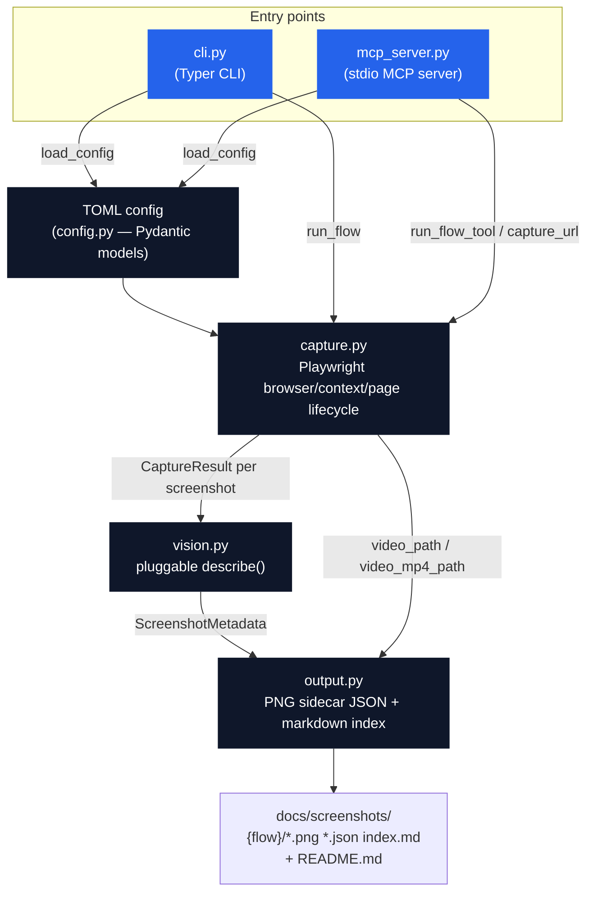
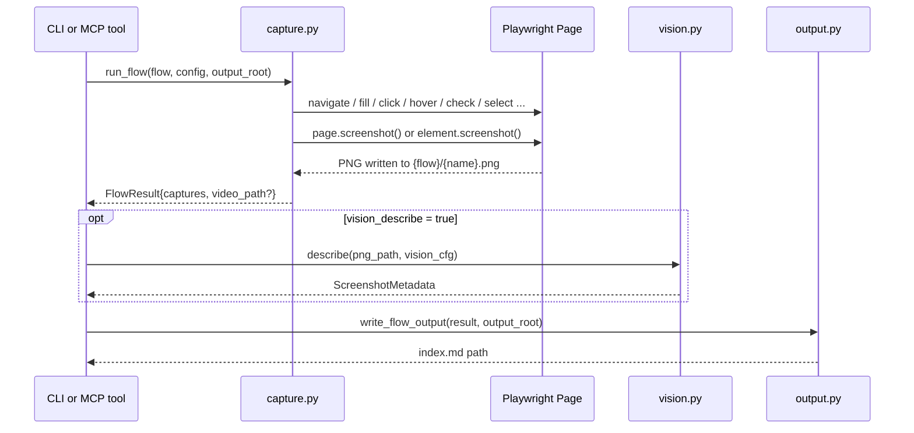

# Architecture

Screenwright has two entry points (CLI, MCP server) that both call into the same
capture/vision/output core. Neither entry point talks to Playwright directly —
`capture.py` owns the browser lifecycle.

## Module responsibilities

| Module | Owns |
|---|---|
| `config.py` | TOML → Pydantic models (`ScreenwrightConfig`, `Flow`, `Step` discriminated union, `VisionConfig`). No I/O beyond reading the TOML file. |
| `capture.py` | The only module that touches Playwright. `run_flow` drives one `Browser` + (optionally) one recording `BrowserContext` through a flow's steps, closes them, and finalizes video. `capture_single_url` is the one-shot path used by the MCP `capture_url`/`capture_element` tools. |
| `vision.py` | `describe(image_path, cfg) -> ScreenshotMetadata`. Three private per-provider implementations (`_describe_anthropic`, `_describe_openai`, `_describe_ollama`) share prompt-building (`_build_prompt`) and response-parsing (`_parse_response`, which degrades gracefully to a raw-text description if the model doesn't return valid JSON). |
| `output.py` | Turns `FlowResult`/`CaptureResult` objects into the on-disk docs structure: `{name}.json` sidecars, `{flow}/index.md`, root `README.md`. |
| `cli.py` | Typer commands (`run`, `flows`) — orchestrates `load_config → run_flow → describe (if enabled) → write_flow_output`, one flow at a time, with a Rich progress display. |
| `mcp_server.py` | FastMCP server exposing `capture_url`, `capture_element`, `run_flow_tool`, `list_flows`, `describe_screenshot` as MCP tools over stdio. Config resolution falls back to `SCREENWRIGHT_CONFIG` env var when a tool call doesn't pass `config_path`. |

## Data flow for one `capture` step

## Why this shape

- **One capture core, two entry points.** The CLI and the MCP server are both thin — all the
  actual Playwright/vision/output logic lives in `capture.py`/`vision.py`/`output.py` so the two
  entry points can't drift out of sync.
- **Video recording is flow-scoped, not step-scoped**, because Playwright ties video capture to
  a `BrowserContext`, which can't be paused/resumed mid-flow. See `Flow.record` in `config.py`
  and the context-vs-page branch in `capture.py::run_flow`.
- **Vision is fully optional and provider-swappable** so a private/air-gapped flow (Moondream2
  via Ollama) and a cloud flow (Claude Haiku / GPT-4o-mini) use the exact same `describe()`
  interface and the exact same `ScreenshotMetadata` shape downstream.
- **Neither browser/context/page setup nor a step failure ever raises out of `run_flow`.** Setup
  (including loading `Flow.storage_state`) and the step loop are both wrapped — a bad
  `storage_state` path, a missing/expired session, or a bad selector on step 4 of 5 all land on
  `FlowResult.error`/`failed_step_index`, and video is always finalized + the browser always
  closed in a `finally` block regardless of where things stopped. `run_flow_tool` surfaces this
  as a `{captures, error, failed_step_index, ...}` dict so an agent driving Screenwright sees a
  partial result it can act on, not a failed tool call or an unhandled exception.
- **Auth is session injection, not scripted login.** `Flow.storage_state` loads Playwright's own
  cookie/localStorage export before any step runs — the standard, robust way to capture an
  already-authenticated session for an internal app, instead of re-running a fragile
  fill/click login sequence (2FA, CAPTCHAs, rate limits) on every capture.
- **Accessibility snapshots are a first-class capture output, not a vision-model afterthought.**
  `CaptureStep.accessibility_snapshot` writes Playwright's `aria_snapshot()` — the exact
  semantic tree assistive technology sees — to `{name}.aria.yaml`, free and deterministic,
  versus a vision model's paid, approximate guess at the same PNG. Always whole-page: Playwright
  exposes `aria_snapshot()` on `Page`/`Locator`, not on the `ElementHandle` this step's
  selector-scoped screenshot path uses.
- **PDF export follows the same shape, for the same reason.** `CaptureStep.pdf` calls
  `page.pdf()` — also whole-page-only, also Chromium-only — so it's not scoped to `selector`
  either, matching `accessibility_snapshot`'s constraint rather than pretending otherwise.
- **Capture variants change the existing page in place, not the browser/context lifecycle.**
  `CaptureStep.variants` loops within the existing `CaptureStep` branch and calls
  `page.set_viewport_size()`/`page.emulate_media()` on the already-open page before each
  variant's capture — no new context or page is created. This was a deliberate choice over the
  alternative (spin up a fresh context per variant) specifically to avoid touching the
  browser/context setup path at all, keeping this feature low-risk against the well-tested
  video-recording and error-handling code that setup path shares. One real gotcha this
  uncovered: `page.emulate_media(color_scheme=None)` is a no-op, not a reset — restoring the
  flow's default after a `color_scheme` variant requires an explicit `"light"`, not `None`.
- **Determinism is the default, not opt-in.** `CaptureStep.animations` defaults to `"disabled"`
  (Playwright's own screenshot default is `"allow"`) — a deliberate departure, since a
  documentation tool capturing a random mid-animation frame is rarely intended and is the
  single biggest source of unnecessary pixel diffs between otherwise-identical runs.
  `CaptureStep.mask` fills selected elements with a solid color before capturing (live clocks,
  avatars, etc.); unlike `selector`, a `mask` entry matching nothing is a silent no-op, verified
  directly against the installed Playwright before relying on it — an optional masking target
  not being present everywhere a flow runs isn't a flow failure.
- **Concurrency is opt-in, not the default, in the CLI.** `cli.py run --concurrency N` bounds
  concurrent flows with an `asyncio.Semaphore`, defaulting to 1 — identical sequential behavior
  to before this option existed. This meant restructuring `run` from "call `asyncio.run()` once
  per flow in a sync loop" to one `asyncio.run()` wrapping the whole command, and wrapping the
  synchronous `describe()` call in `asyncio.to_thread()` so it doesn't block other flows'
  progress under `--concurrency > 1`. The per-flow progress task is created only after the
  semaphore is acquired (not upfront for every flow), so the default case's progress display is
  pixel-for-pixel the same as before — tasks appear one at a time, in order.
- **HAR capture required broadening the page-close logic, not just adding a Playwright kwarg.**
  `Flow.har` passes `record_har_path` to `browser.new_page()`/`new_context()` the same way
  `storage_state` does, but the `.har` file — like `.webm` — only flushes when the page (and
  context, if any) is explicitly closed, not on `browser.close()` alone. Before this, the
  non-`record` path never closed `page` explicitly (relying on `browser.close()` to sweep it
  up), which is exactly the case where HAR would have silently produced an empty/missing file.
  Verified directly against the installed Playwright before writing any code, and the finalize
  block's guard broadened from `context is not None and page is not None` to just
  `page is not None` so `page.close()` always runs — harmless when neither video nor HAR is
  active, required when either is.
