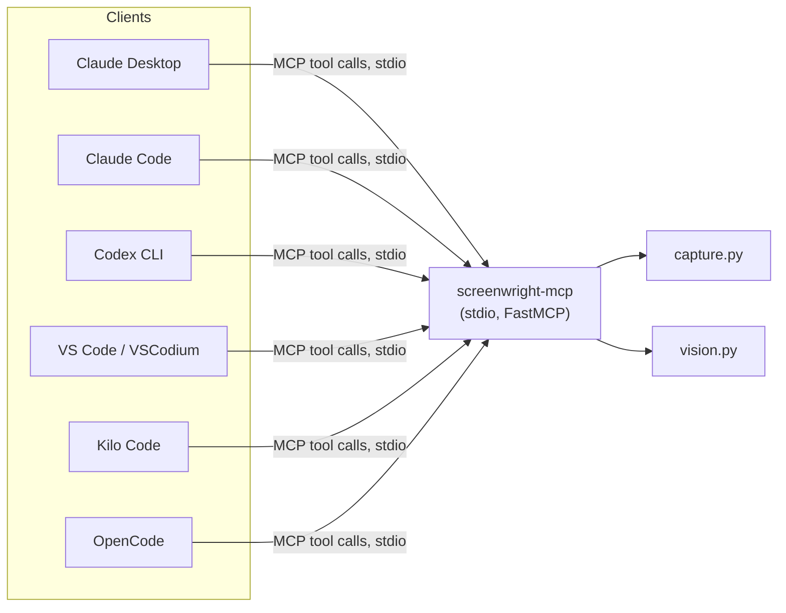

# MCP Tools Reference

For AI agents driving `screenwright-mcp`, and for developers wiring it into a client. Server is
a standard [`mcp`](https://pypi.org/project/mcp/) Python SDK stdio server — see `mcp_server.py`.
Client setup per host (Claude Desktop/Code, Codex CLI, VS Code, VSCodium, Kilo Code, OpenCode) is
in the README's [MCP Server Setup](../README.md#mcp-server-setup) section.



Config resolution for every tool: an explicit `config_path` argument wins; otherwise the server
falls back to the `SCREENWRIGHT_CONFIG` environment variable set in the client's MCP config; if
neither is set, an empty default `ScreenwrightConfig()` is used (fine for `capture_url`/
`capture_element`, which don't need flows).

---

## `capture_url`

Navigate to a URL and capture a screenshot. No config file needed.

| Param | Type | Required | Description |
|---|---|---|---|
| `url` | string | yes | Full URL to navigate to |
| `name` | string | yes | Filename stem for the PNG (no extension) |
| `selector` | string | no | CSS selector — captures only that element instead of full page |
| `output_dir` | string | no | Where to save the PNG. Defaults to a temp directory |

**Returns:** `string` — absolute path to the saved PNG.

**Example call (as an agent would invoke it):**
```json
{"tool": "capture_url", "arguments": {"url": "https://example.com", "name": "homepage"}}
```

## `capture_element`

Same as `capture_url` but `selector` is required — captures one DOM element.

| Param | Type | Required | Description |
|---|---|---|---|
| `url` | string | yes | Full URL to navigate to |
| `selector` | string | yes | CSS selector for the element |
| `name` | string | yes | Filename stem for the PNG |
| `output_dir` | string | no | Where to save the PNG |

**Returns:** `string` — absolute path to the saved PNG.

## `run_flow_tool`

Execute a named flow from a TOML config — the multi-step, potentially video-recording path.

| Param | Type | Required | Description |
|---|---|---|---|
| `flow_name` | string | yes | Name of the flow to run (must exist in the config) |
| `config_path` | string | no | Path to TOML config. Falls back to `SCREENWRIGHT_CONFIG` |
| `output_dir` | string | no | Override the config's `output_dir` |

**Returns:** a dict:
```json
{
  "captures": ["<absolute PNG path>", "..."],
  "video_path": "<absolute .webm path> | null",
  "video_mp4_path": "<absolute .mp4 path> | null",
  "error": "<string> | null",
  "failed_step_index": "<int> | null"
}
```

If a step fails mid-flow, this does **not** raise — `captures` still contains everything
captured before the failure, `error`/`failed_step_index` describe what went wrong, and any
in-progress video recording is still finalized (Playwright only flushes a `.webm` on context
close, so a naive implementation would lose the whole recording on a mid-flow error — this one
doesn't). An agent should treat a non-null `error` as "partial success, here's what happened,"
not as a failed tool call.

**Raises:** `ValueError` only for a missing `flow_name` (message includes the list of available
flow names) or a config-loading error — never for a step failing during the flow itself.

## `list_flows`

| Param | Type | Required | Description |
|---|---|---|---|
| `config_path` | string | no | Path to TOML config. Falls back to `SCREENWRIGHT_CONFIG` |

**Returns:** `list[string]` — flow names defined in the config.

## `describe_screenshot`

Send an already-captured PNG to a vision model independently of a flow run.

| Param | Type | Required | Description |
|---|---|---|---|
| `screenshot_path` | string | yes | Absolute path to the PNG |
| `provider` | string | no | `"anthropic"` (default), `"openai"`, or `"ollama"` |
| `model` | string | no | Model name — e.g. `"claude-haiku-4-5"`, `"gpt-4o-mini"`, `"moondream"` |
| `structured_metadata` | bool | no | Default `true` — return JSON metadata instead of plain text |

**Returns:** `string` — JSON-encoded `ScreenshotMetadata` if `structured_metadata=true`, else the
plain-text description.

**Raises:** `FileNotFoundError` if `screenshot_path` doesn't exist.

---

## Error handling for agents

None of the five tools currently retry internally — a failed navigation, a bad selector, a
missing API key, or an unreachable vision provider surfaces as a raised exception that the MCP
client displays as a tool error. An agent driving Screenwright should treat a tool-call failure
as informative (bad selector, wrong flow name, etc.) rather than transient, and adjust the next
call rather than blindly retrying the same arguments.
